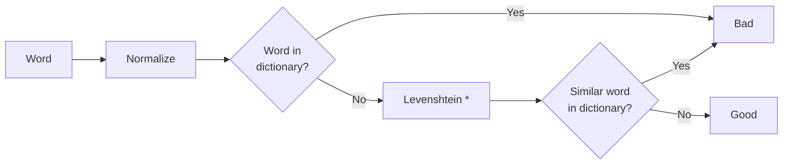

# Bad-Words

This API is designed to identify so-called "bad words" and minimize the number of false positives.

A particular challenge in this context is leeting.
Leeting involves using similar-looking characters to slightly modify a bad word, thereby tricking a primitive filter. For example, "hello" becomes "hell0". While humans can easily recognize these similarities, for a computer, this is not a trivial task.

Another challenge is that in different languages, letters may sound different and thus may be used differently.

Additionally, the entire algorithm needs to be fast.

This program is designed to address these challenges.

## Checking for bad words

The following is a flowchart of the process of checking for bad words.



### Normalize

The first step is to normalize the word.

The normalization process is as follows:

1. Convert the word to lowercase.
2. Replace all non-letter characters with a marker.

#### Example:
```
"H€ll0!" -> "h*ll**"
```

### Word in dictionary?

The second step is to check if the word is in the dictionary.
If the word is in the dictionary, it is considered a bad word.

### Levenshtein *

If the word is not in the dictionary, the next step is to calculate the Levenshtein distance between the word and all the words in the dictionary.
If the Levenshtein distance is less than or equal to a certain threshold, the word is considered a bad word.

To account for the length of the word, the threshold is calculated as follows:

```
threshold = word.length * 0.2
```

Because users often use special characters to bypass bad word filters, the Levenshtein distance is calculated using the normalized words.
Therefore, the distance between the marker and any letter (or an empty string) is 0.

#### Example:
```
levenshtein("h*ll**", "hello") = 0
```